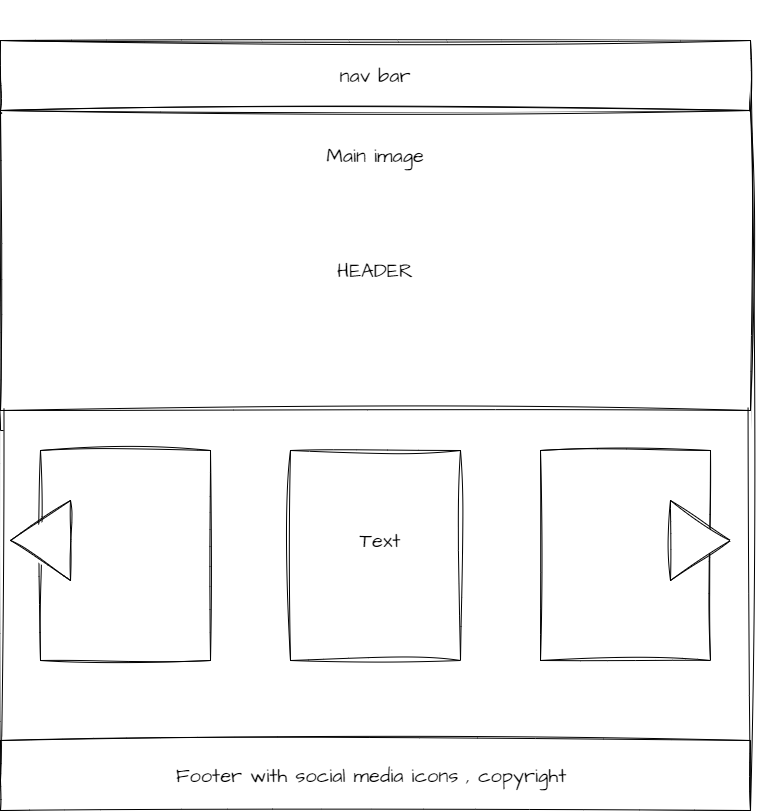
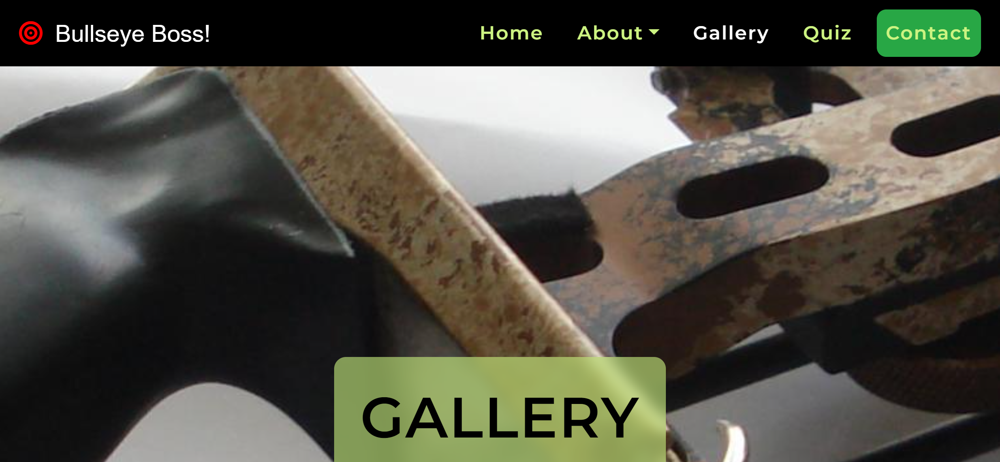

<h1 align="center">Bullseye Boss</h1>

<a href="https://develogenics.github.io/Bullseye-Boss/" rel="nofollow">View site here</a>

<h2 align="center">What the site is about and the user experience offered</h2>

Bullseye Boss is a site for those who enjoy or are looking to take up archery in their local area. The site explains who bullseye boss is, what they are about and what they have to offer, the idea is to get everyone interested regardless of who they are. There is a home page, about, gallery, small quiz and a contact page with many forms of contact and a map where bullseye boss is located.

<h2 align="center">Design</h2>

Draw.io was used for wireframes, 

<h3>Index</h3>

<h3>About</h3>

<h3>Gallery</h3>

<h3>Quiz</h3>

<h3>Contact</h3>

<h2 align="center">Page contents</h2>
  
<h3>Index</h3>

The Index page consists of a bootstrap nav menu with 5 links, one of which is a drop down with 4 links, links to wikipedia on recurve bows, compound bows and traditional archery.

There is a main image that slowly zooms in using css animation that was taking from code institue modules, It has a header in the center with a transparent background. Below the main image is another section with two images, each image has a header and a paragraph, these are also linked to the wikipedia pages for compound bows and traditional bows.

On window load an alert welcome message appears.

  
<h3>About section </h3>
  
The about section contains a main image with header, underneath this section is another section with two images stacked on top of each other. On the right hand side are headings and paragraphs telling the user what bullseye boss is about, who they cater for, how many days they are open, private lessons, free equipment usage, a friendly family orientated environment and the low fees.

  
<h3>Gallery</h3>

The gallery page once again has a main image with header in the center. Underneath this section is another section taht contains a gallery, the gallery consists of many images horizontaly, in desktop view there are three of them which turns into two then one as the resolution changes. 

The gallery can be moved by grabbing with the mouse or by clicking arrows on each side, the photos then slide along smoothly, this function was done in JS.

  
<h2>Quiz</h2>
  
The quiz page consits of main image section with header, underneath a section that contains a javascript quiz. There are three questions, after answering each question you click submit and it moves to the next question, once the final question is asked and you click submit you will be given your score.

<h2>Contact</h2>
  
The contact page has a form, a submit button, social media links, a telephone number and a google maps link. 

<h2 align="center">Responsive Design</h2>

The website was designed with mobile first usage in mind. All pages used media queries, but the nav bar used bootstrap.

All items move around each other, keep their original view but change size to suit. The nav bar has a handburger menu that when the screen goes smaller it comes out, once clicked the nav links appear.

  
<h2 align="center">Typography</h2>

The site uses font-family: 'Montserrat', sans-serif; for headings and font-family: 'Playfair Display', serif; for paragraphs
  
<h2 align="center">Icons</h2>
  
The website uses icons from font awesome for social media links in the footers and on the contact and form page.

<h2 align="center">Images</h2>
  
All photos were taken from a google search, photoshop was used to change their size and crop them to keep uneeded size down.

<h2 align="center">Color scheme</h2>

The site had two a color scheme of standard black and a nice shade of green #CCF381, these passed all contrast checks with AAA.

<h2 align="center">Validation</h2>

Fixed all errors for the css and html files and passed the validators, the contrast was checked and passed also. I could not get rid of 1 error in eslint, I tried all alternative lines from what I could research at the moment, but have not had any result, the code functions perfectly and smoothly, I will be coming back to this until it is fixed.

  
<h2 align="center">Frameworks libraries and software used</h2>

Photoshop was used to comprees images and give them resolutions easier to work with.
Bootstrap was used to create the nav bar and footer, the rest of the content and to make it responsive along with a hamburger menu in mobile view.
Fontawesome was used for icons.
Github was used to store all files for the site.
Codeanywhere and Gitpod was used to commit the code.
Google Chrome Developer Tools were used for debugging and testing responsiveness.
Google Fonts was used to import the fonts used.
Brackets was used to create the code and notepad++ was used to compare
Draw.io was used to create the wireframes.
  
<h2 align="center">Version control</h2>

Code anywhere and Gitpod were used to commit the files and folders to github. https://develogenics.github.io/Bullseye-Boss/

<h2 align="center">Languages used</h2>

html

css

html bootstrap

JS

Jquery

<h2 align="center">Credit</h2>

All code was either self created or was learned from codeinstitute, stack overflow, w3cschools, youtube, code-pen

Written by John McGowan: full stack web developer student at code institute 2023.
  

